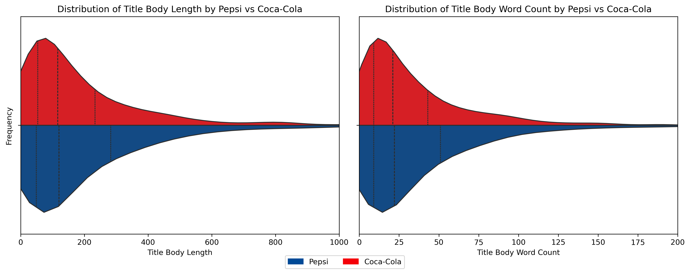
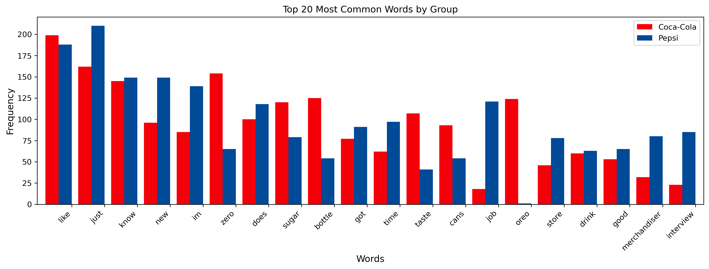
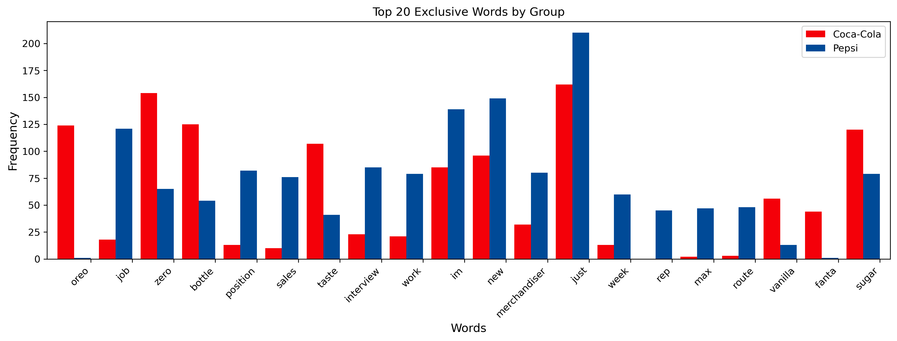
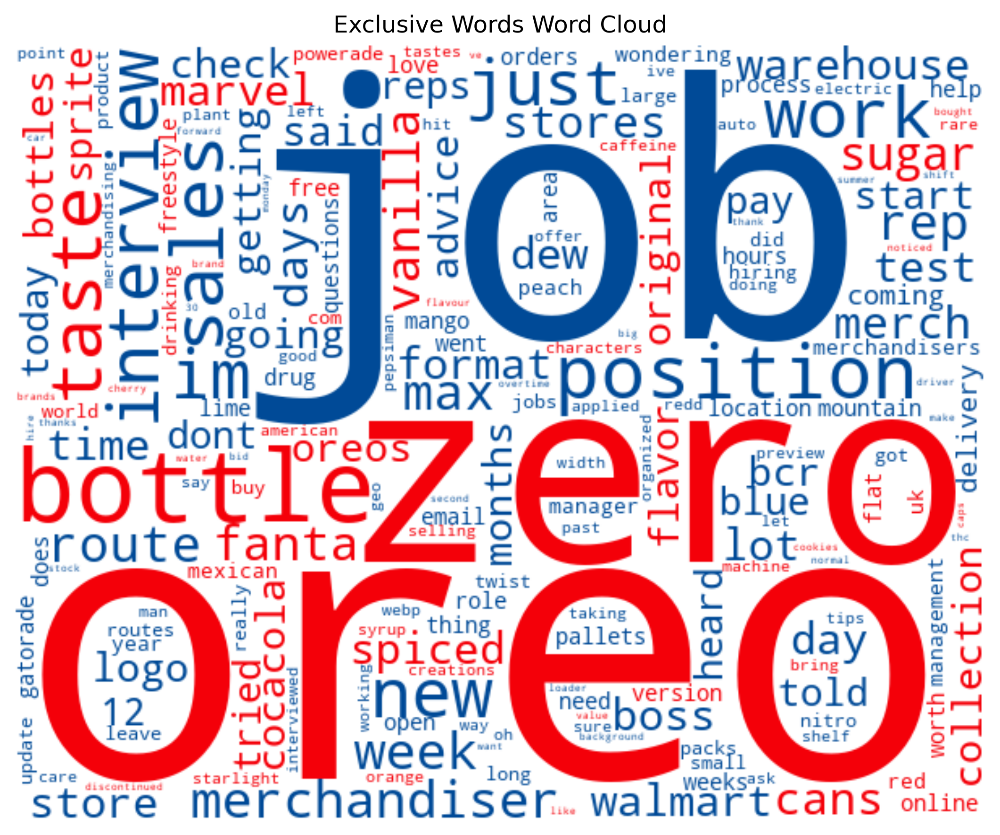
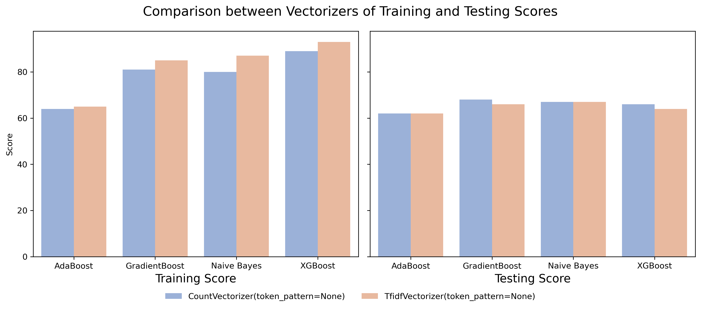
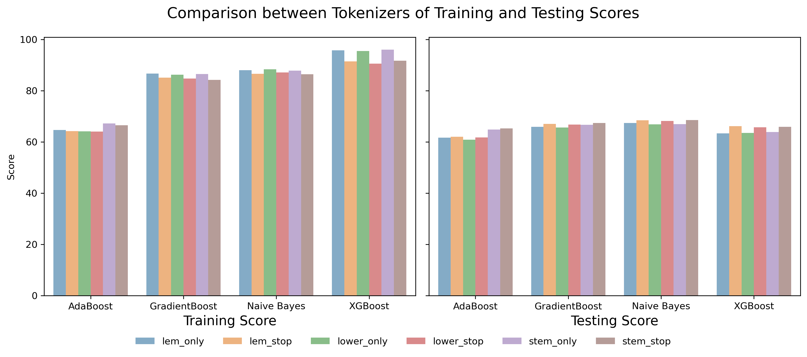
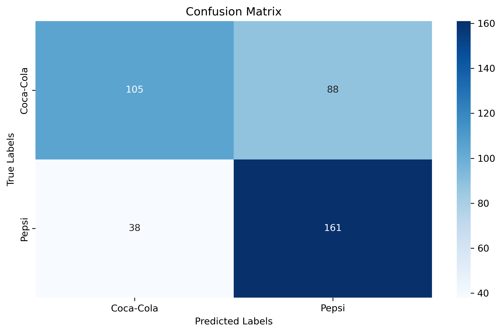

##  Project 3: NLP Classification: Subreddit Pepsi vs Coca-Cola | README

**README** | [Part 1: EDA](code/01_EDA.ipynb) | [Part 2: Vectorizer](code/02_Vectorizer.ipynb) | [Part 3: Vectorizer Performance](code/03_Vectorizer_Performance.ipynb) | [Part 4: Model Tuning](code/04_Model_Tuning.ipynb)

---

### Introduction

The goal of **NLP Classification**: Subreddit **Pepsi** vs **Coca-Cola** is to leverage natural language processing (NLP) techniques for classifying text data based on subreddit discussions about **Pepsi** and **Coca-Cola**. To accomplish this, several key NLP concepts need to be applied:

**Tokenization**: Breaking down the text into smaller units (tokens) such as words, phrases, or characters. This process helps in understanding the structure and content of the text.

**Vectorization**: Converting the tokenized text into numerical representations that machine learning algorithms can process. Techniques like `CountVectorizer` and `TF-IDF Vectorizer` are used to transform text into vectors based on word frequency or importance.

**Classification**: Applying machine learning classifiers to predict the category (Pepsi or Coca-Cola) of the text. This involves training models using algorithms such as `Naive Bayes` or more complex models like `Gradient Boosting` or `XGBoost`.

---

### Exploratory Data Analysis

We will explore the distinguishing patterns between two subreddits: **Pepsi** and **Coca-Cola** and. The data from both subreddits has been extracted into the file `subreddit_pepsi_vs_cocacola.csv` using Reddit APIs.

Although the dataset contains many columns, we have cleaned and filtered it to use only a few key columns. The following data dictionary outlines the relevant columns included in the analysis.

| Column Name            | Data Type | Description                                                     | Example                                                            |
|------------------------|-----------|-----------------------------------------------------------------|--------------------------------------------------------------------|
| title_body             | object    | The concatenation of the title and body of the subreddit post   | Happy Veterans Day! Coca-Cola poster sealed down...               |
| title_body_length      | int64     | The length of the post in terms of characters (including spaces) | 50                                                                 |
| title_body_word_count  | int64     | The word count of the post                                      | 25                                                                 |
| is_pepsi               | int64     | Indicator if the post is about Pepsi (1 = Pepsi post, 0 = Coca-Cola post) | 1                                                                 |

Upon further exploration, we observed the following key points:
- **Similarities in Lower Quartiles**: Both **Pepsi** and **Coca-Cola** show similar patterns in the first quartile and median, with only slight differences.
- **Differences in Higher Quartiles**: The third quartile and maximum values show clear differences, with **Pepsi** generally having longer titles (both in terms of length and word count) at the higher end of the distributions.

This distinction in the higher quartiles is visually captured in the *violin plots*, which illustrates the spread of post lengths and word counts for both brands. The plot clearly shows that Pepsi posts have a wider distribution at the top end, reflecting more variation in post lengths, while Coca-Cola posts cluster more tightly around shorter lengths.

After performing vectorization using **CountVectorizer** and removing brand-specific words, we ended up with 6,309 features in the dataset. This extensive feature set captures the diversity of words used in the posts across both brands.

Top 20 Common Words: The most frequently occurring words in the dataset across both **Pepsi** and **Coca-Cola** include terms such as "like," "just," "know," "new," "im," "zero," "does," "sugar," "bottle," "got," "time," "taste," "cans," "job," "oreo," "store," "drink," "good," "merchandiser," and "did." These words reflect the general discourse that is not brand-specific but is commonly found in many conversations or posts, making them typical of social media communication.

Interestingly, the word *oreo* is predominantly used in discussions about Coca-Cola, setting it apart as a distinctive word for this brand. This word will be classified as an "exclusive word" for Coca-Cola, as its use is rare in Pepsi posts. The inclusion of such exclusive words helps in better distinguishing between the two brands in our classification model. Below is a bar chart that shows the exclusive words and their occurrences.

Thus, we summarize the findings with a word cloud showing the dominance of exclusive words. Words in blue occur significantly more in **Pepsi** posts, while words in **red** are more prevalent in Coca-Cola posts.

### Vectorizer & Tokenizer Performance

A vectorizer is a method used to convert text data into numerical representations, enabling machine learning models to process and analyze the data effectively. We compared the effects of two vectorizers, CountVectorizer and TfidfVectorizer. As shown in the graphs below, TfidfVectorizer outperforms CountVectorizer across all four models in terms of training accuracy and performs similarly in testing accuracy..

On the other hand, a tokenizer is a technique used to break down text into smaller components, such as words or phrases, to prepare it for analysis. We compared the effects of different tokenization strategies, including lemmatization, stemming, and simple lowercasing, combined with either retaining or removing stopwords. From the charts, stemming performs well with AdaBoost, while retaining stopwords yields better training accuracy, particularly for XGBoost. However, removing stopwords results in better performance on the testing set.

Notably, Naive Bayes is the only model that is affected by n-gram_range and min_df. Using bigrams and setting min_df = 2 yields higher accuracy.

### Model Tuning

The goal of the model is to predict outcomes effectively, and to achieve this, we selected the model with the highest testing F1 score. The chosen model is Gradient Boosting, which achieved a 75% F1 score, with an accuracy of 81% on the training set and 70% on the testing set during cross validation. The parameters for this model are as follows: it uses a CountVectorizer for feature extraction, with tokenization performed by lowering the text and removing English stopwords. Additionally, the vectorizer is configured to extract unigrams and bigrams, with a maximum of 3000 features, a min_df value of 3, and a max_df value of 0.9.

Note that the Gradient Boosting Classifier is an algorithm that builds an ensemble of weak learners, specifically decision trees, to improve prediction accuracy. It works iteratively, with each subsequent tree correcting the errors made by the previous ones.

We tune this model by adjusting the learning rate, the number of trees, the subsample used for each tree, the minimum samples required to make a split, the minimum samples required for a leaf node, the maximum depth of each tree, and the maximum number of features considered. Unfortunately, it appears that the default settings performed the best. Here are the results matrix.

The model performs better at identifying Pepsi instances, as indicated by the high recall. However, it is less precise, meaning it sometimes misclassifies Coca-Cola as Pepsi. This suggests a slight bias toward predicting Pepsi. The overall accuracy indicates there is room for improvement in differentiating between the two classes effectively. The performance metrics are summarized in the table below:

| Metric        | Value       |
|---------------|-------------|
| **Precision** | 64.66%      |
| **Recall**    | 80.90%      |
| **F1 Score**  | 71.88%      |
| **Accuracy**  | 67.86%      |

### Predicting Sponsors Using the Model

The task was to predict the sponsor (either Pepsi or Coca-Cola) of 10 well-known events or brands based on their missions. The model was trained on data from subreddits, and we applied it to identify which sponsor (Pepsi or Coca-Cola) aligns best with the mission of each company. Below, we summarize the results of our predictions:

#### Overview
The model was tested on 10 events/brands, and it made predictions based on their mission statements. The analysis of the predictions is as follows:

- **Correct Predictions**: 6 events (4 for Pepsi, 2 for Coca-Cola).
- **Incorrect Predictions**: 3 events.
  
This indicates that while the model accurately predicted Pepsi sponsors most of the time, it sometimes misclassified Coca-Cola-sponsored events as Pepsi, particularly for brands like the NBA and Coca-Cola 600.

#### Results Summary

| Brands                           | Missions                                                                              | Actual Sponsors | Predicted    |
|----------------------------------|---------------------------------------------------------------------------------------|-----------------|--------------|
| **Olympic Games**                | To inspire the world to be better through the Olympic spirit.                         | Coca-Cola       | Pepsi        |
| **FIFA World Cup**               | To unite and inspire the world through football.                                      | Coca-Cola       | Coca-Cola    |
| **NBA**                          | To be the world's most innovative and inclusive sports league.                        | Coca-Cola       | Pepsi        |
| **McDonald's**                   | To provide high-quality fast food to billions of customers worldwide.                | Coca-Cola       | Coca-Cola    |
| **Coca-Cola 600 (NASCAR)**       | To celebrate motorsport excellence and innovation.                                    | Coca-Cola       | Pepsi        |
| **NFL (National Football League)**| To be the most popular and successful sports league in the world.                    | Pepsi           | Pepsi        |
| **UEFA Champions League**        | To inspire and engage the world by delivering world-class football.                   | Pepsi           | Pepsi        |
| **Pepsi Super Bowl Halftime Show**| To provide unforgettable entertainment during the biggest NFL event.                  | Pepsi           | Pepsi        |
| **MTV Video Music Awards (VMAs)**| To connect music and culture to a global audience.                                    | Pepsi           | Coca-Cola    |
| **Lay's**                        | To delight consumers with a wide variety of tasty snacks.                             | Pepsi           | Pepsi        |

#### Analysis of the Results
The model shows a strong performance in predicting **Pepsi** as the sponsor, especially for events that clearly align with Pepsi's brand image, such as the **NFL** and **Pepsi Super Bowl Halftime Show**. However, it tends to predict **Pepsi** more frequently even for some **Coca-Cola**-sponsored events, as seen with the **Olympic Games** and **NBA**, where Coca-Cola is actually the sponsor.

The overall accuracy is quite high for events that are traditionally associated with Pepsi, but the model has room for improvement when distinguishing between **Coca-Cola** and **Pepsi**. Events like the **Coca-Cola 600 (NASCAR)** and the **MTV Video Music Awards** show that there is still some confusion between the two sponsors.

#### Conclusion and Next Steps
While the model works well for certain types of events, there is a tendency to favor **Pepsi** over **Coca-Cola**. This bias could be improved with further tuning or by providing the model with more balanced training data. Additionally, incorporating more features, such as the type of event or deeper brand associations, could help the model improve its predictions for Coca-Cola-sponsored events.

In summary, the model shows promise but requires refinement to increase its accuracy and reduce the frequency of misclassifications. Further work is needed to ensure that Coca-Cola events are accurately identified.

